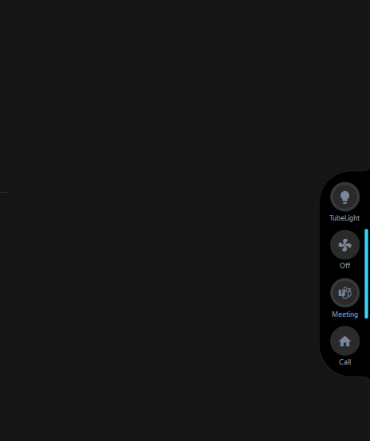
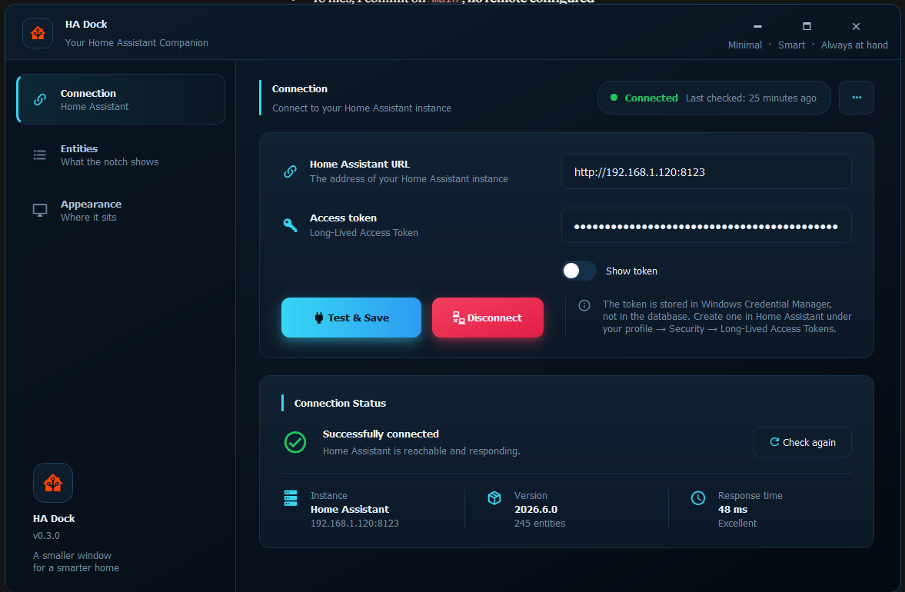
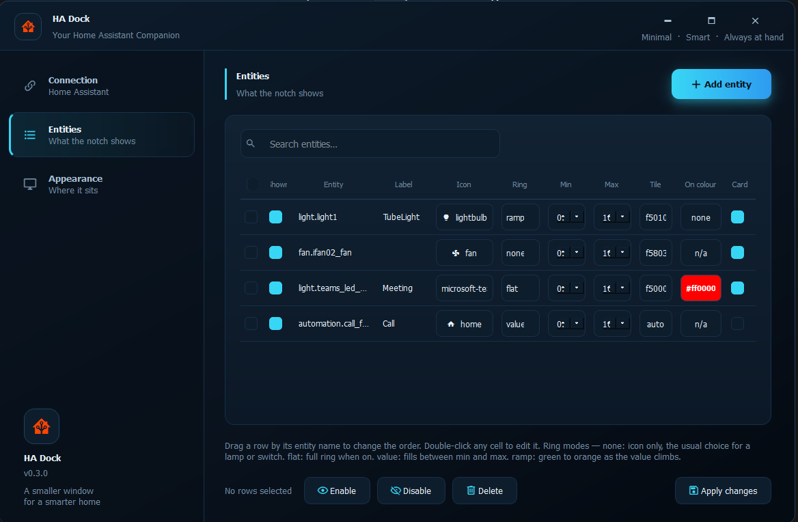
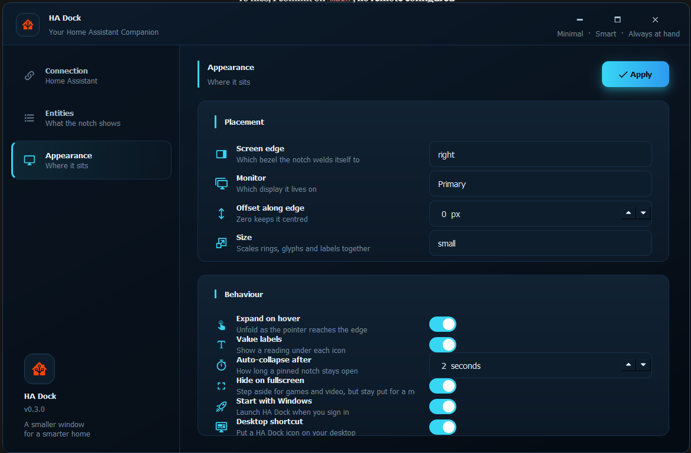

# HA Dock

**A Home Assistant controller that lives on the edge of your screen.**

At rest, HA Dock is a thin sliver welded to the edge of your monitor. Brush
it with the mouse and it unfolds into a black pill holding one round tile
per device. Click a tile to toggle it. Hover one and a card slides out with
a brightness slider, a fan speed, a colour wheel.

No window to find, no tab to switch to, no taskbar space. The lights are
just *there*, at the edge, where the bezel already is.



---

## Contents

- [What you get](#what-you-get)
- [Screenshots](#screenshots)
- [Before you start](#before-you-start)
- [Installation](#installation)
- [Getting a Home Assistant token](#getting-a-home-assistant-token)
- [First run](#first-run)
- [Using the notch](#using-the-notch)
- [The detail card](#the-detail-card)
- [Entity options explained](#entity-options-explained)
- [Appearance options explained](#appearance-options-explained)
- [Building a standalone .exe](#building-a-standalone-exe)
- [Where your data is kept](#where-your-data-is-kept)
- [Troubleshooting](#troubleshooting)
- [For developers](#for-developers)
- [Credits](#credits)
- [Licence](#licence)

---

## What you get

- **Always within reach.** A sliver on the screen edge that unfolds on hover
  or click and folds away on its own.
- **One tap per device.** Lights, switches, fans, covers, scenes, scripts,
  automations, media players.
- **A detail card** with a brightness slider, fan speed, cover position,
  media volume, thermostat setpoint, and an HSV colour wheel for colour
  bulbs.
- **Per-light default colours.** Tell a lamp to come on red and it comes on
  red.
- **Live state.** Pushed over the Home Assistant WebSocket API, so tiles
  update the instant something changes, whoever changed it.
- **Any screen edge**, any monitor, three sizes.
- **Steps aside for fullscreen** games and video, but stays put for a merely
  maximised window.
- **Never steals focus.** You can click a light in the middle of typing and
  keep typing.

---

## Screenshots

**At rest** — a sliver with a status bar. Cyan means connected, orange means
the connection is down.


**Connection** — paste a URL and a token, press Test & Save, and it reports
the version, entity count and round-trip time.



**Entities** — pick what the notch shows, and how each tile looks and
behaves.



**Appearance** — which edge, which monitor, how big, how it behaves.



---

## Before you start

You need three things:

| | |
| --- | --- |
| **Windows** | 10 or 11 |
| **Python** | 3.13 or newer. Install from [python.org](https://www.python.org/downloads/) — **not** the Microsoft Store build, which has filesystem quirks that break virtual environments and shortcuts. |
| **Home Assistant** | Any recent version, reachable from this PC over HTTP or HTTPS. |

To check Python is installed and visible, open PowerShell and run:

```powershell
py -0p
```

You should see a list of Python installations with paths. If the command
isn't found, Python isn't on your PATH — reinstall and tick *Add Python to
PATH*.

---

## Installation

**1. Get the code**

```powershell
cd F:\Projects
git clone https://github.com/<your-username>/ha-dock.git
cd ha-dock
```

No git? Download the ZIP from the repo's green *Code* button and extract it.

**2. Create a virtual environment**

This keeps HA Dock's dependencies away from the rest of your system.

```powershell
py -3.14 -m venv .venv
```

Use whichever version you have — `py -3.13 -m venv .venv` is fine.

**3. Install the dependencies**

```powershell
.\.venv\Scripts\python.exe -m pip install -r requirements.txt
```

That pulls in PySide6 (the interface), websockets (the Home Assistant
connection), keyring (secure token storage) and qtawesome (the icons). It's
around 100 MB and takes a minute or two.

**4. Run it**

```powershell
.\.venv\Scripts\python.exe run.py
```

The settings window opens by itself the first time, because there's no token
saved yet.

> **Tip:** once it's set up, launch with `pythonw.exe` instead of
> `python.exe` and you won't get a console window hanging around:
> `.\.venv\Scripts\pythonw.exe run.py`

---

## Getting a Home Assistant token

HA Dock signs in with a Long-Lived Access Token rather than your password.

1. Open Home Assistant in a browser.
2. Click **your name** at the bottom of the left sidebar.
3. Go to the **Security** tab.
4. Scroll to the bottom, to **Long-Lived Access Tokens**.
5. Click **Create Token**, name it `HA Dock`, and press OK.
6. **Copy the token now.** Home Assistant shows it exactly once. If you lose
   it, delete that token and make another.

The token is stored in **Windows Credential Manager**, not in HA Dock's
database or any config file.

---

## First run

**1. Connect**

On the **Connection** page, fill in:

- **Home Assistant URL** — for example `http://homeassistant.local:8123`, or
  an address like `http://192.168.0.50:8123`. Include the port.
- **Access token** — paste the token from above. Use the *Show token* switch
  if you want to check it pasted cleanly.

Press **Test & Save**. On success the pill at the top turns green and the
Connection Status card fills in with your version, entity count and response
time. If it fails, it tells you why — see
[Troubleshooting](#troubleshooting).

**2. Add your devices**

Go to the **Entities** page and press **Add entity**. Start typing and the
list filters to your actual entity IDs, pulled live from Home Assistant. Pick
one and press OK.

Repeat for each device you want on the notch. Four to six is comfortable;
more than that and the notch gets tall.

**3. Tidy up each row**

Set a short **Label**, choose an **Icon**, and adjust anything else you fancy
— all the options are explained [below](#entity-options-explained). Press
**Apply changes** when you're done. A confirmation appears at the bottom of
the window.

**4. Place the notch**

On the **Appearance** page, choose the screen edge, monitor and size, then
press **Apply**.

**5. Make it permanent**

Still on Appearance, turn on **Start with Windows** so it's there after a
reboot, and **Desktop shortcut** if you want an icon to launch it by hand.

Close the settings window — it hides rather than quitting. HA Dock keeps
running in the system tray.

---

## Using the notch

| Action | What happens |
| --- | --- |
| Hover the sliver | Unfolds (if *Expand on hover* is on — it is by default) |
| Click the sliver | Unfolds and pins it open |
| Click a tile | Toggles the light, runs the scene, triggers the automation |
| Hover a tile | Opens its detail card, if that tile has one enabled |
| Click the notch body | Unpins, letting it fold away |
| Click anywhere else | Folds it away |
| Right-click the notch | Settings, Collapse now, Reconnect, Hide for 1 hour, Quit |
| Click the tray icon | Opens the settings window |

**Reading a tile.** A tile glows in its accent colour when the device is on
and sits grey when it's off. Grey with no glow at all means Home Assistant
reports it unavailable. A white arc spins while a change is in flight; if
Home Assistant never confirms, the tile rolls back after three seconds and
flashes amber.

**The status bar** along the bezel is cyan when connected and orange-red when
the socket is down or the token was rejected. It's the one thing you can see
when the notch is folded away, which is exactly when you need to know.

---

## The detail card

Enable the **Card** checkbox on an entity's row, then hover its tile.

| Device type | Slider | Buttons |
| --- | --- | --- |
| Light | Brightness | Off, and White or your default colour |
| Fan | Speed | Off |
| Cover | Position | Open, Stop, Close |
| Media player | Volume | Prev, Play/Pause, Next |
| Thermostat | Target temperature | — |

**Colour bulbs** also get a colour wheel: hue around the circle, saturation
outward from the centre. Drag the marker and the bulb follows. The wheel only
appears for lights that actually support colour.

The card stays open while your pointer is on it, and closes shortly after you
move away.

---

## Entity options explained

Each row on the Entities page is one tile. Double-click any cell to edit it,
including the entity ID. Drag a row by its entity name to reorder the tiles.

| Column | What it does |
| --- | --- |
| *(first box)* | Selects the row, for the Enable / Disable / Delete buttons at the bottom. The box in the header selects every row. |
| **Shown** | Whether this tile appears on the notch. Off keeps the configuration but hides the tile. |
| **Entity** | The Home Assistant entity ID, like `light.bedroom`. |
| **Label** | The short caption under the tile. Leave it empty to show the device's current value instead. |
| **Icon** | Any Material Design Icon. Defaults to whatever icon Home Assistant already uses. |
| **Ring** | Whether to draw a progress ring around the tile — see [below](#ring-modes). |
| **Min** / **Max** | The range the ring fills between, for the `value` and `ramp` modes. |
| **Tile** | Override the tile's accent colour. `auto` derives it from the device's state. |
| **On colour** | The colour a light comes on at. Click to pick, right-click to clear. Lights only. |
| **Card** | Whether hovering this tile opens the detail card. |

### Ring modes

Most devices want **none**. A desk lamp doesn't need a percentage drawn
around it.

| Mode | Behaviour |
| --- | --- |
| `none` | Icon only. The tile still tints when the device is on. |
| `flat` | A full ring when on, a bare track when off. |
| `value` | The ring fills between Min and Max. Falls back to the natural value for the device type: brightness, fan speed, cover position, volume. |
| `ramp` | Same fill, coloured green → yellow → orange as the value climbs. Good for battery and disk sensors. |

### About On colour

Set a light's On colour and it comes on at that colour when you click its
tile — one lamp red, another green, without touching a slider.

The colour is only applied when the light goes **from off to on**. If it's
already on, clicking just turns it off. Otherwise every click would slam the
bulb back to its default and fight whatever you had just set on the wheel.

---

## Appearance options explained

| Option | What it does |
| --- | --- |
| **Screen edge** | Which bezel the notch welds itself to: right, left, top or bottom. |
| **Monitor** | Which display it lives on. |
| **Offset along edge** | Nudge it away from centre, in pixels. Negative moves up or left. |
| **Size** | Small, medium or large. Scales the tiles, glyphs and labels together. |
| **Expand on hover** | Unfold as the pointer reaches the edge. Turn it off if you'd rather click. |
| **Value labels** | Show a reading under each icon. |
| **Auto-collapse after** | How long a pinned notch stays open once you move away. Set it to `Never` and only a click will dismiss it. |
| **Hide on fullscreen** | Step aside for games and video. A merely maximised window doesn't count, so the notch stays put over a maximised browser. |
| **Start with Windows** | Launch HA Dock when you sign in. |
| **Desktop shortcut** | Put a HA Dock icon on your desktop. |

---

## Building a standalone .exe

If you'd rather not keep Python around, bundle everything into one folder.

```powershell
.\.venv\Scripts\python.exe -m pip install pyinstaller pillow
.\.venv\Scripts\python.exe build.py --clean
```

The result lands in `dist\HA Dock\`. Run `HA Dock.exe` from there. The folder
is around 140 MB and self-contained — you can move it anywhere, or to another
PC with no Python at all.

```powershell
.\.venv\Scripts\python.exe build.py --onefile
```

`--onefile` gives you a single executable instead, but it unpacks itself to a
temporary folder on every launch, so it starts noticeably slower. For
something that sits in the tray all day, the folder build is the better
trade.

> If you turned on **Start with Windows** or **Desktop shortcut** before
> building, re-toggle them from the .exe. The shortcuts point at whichever
> version created them.

---

## Where your data is kept

| What | Where |
| --- | --- |
| Settings and entities | `%APPDATA%\HADock\hadock.db` (SQLite) |
| Automatic backups | `%APPDATA%\HADock\backups\` — the last 10, copied before each launch |
| Access token | Windows Credential Manager, under `HADock` |

Only one copy of HA Dock runs at a time. Launching it again brings the
existing settings window forward instead of starting a second notch.

**To move your setup to another PC:** copy `hadock.db` across, then enter the
token again on the new machine — tokens are deliberately not stored in the
database.

**To start over:** close HA Dock, delete `hadock.db`, and launch again.

---

## Troubleshooting

**The notch isn't anywhere on screen.**
Check the tray icon is there. Right-click it and choose *Show / hide notch*.
If the icon is red, the connection is down — open Settings and press *Check
again*. Also worth confirming which **monitor** and **edge** are selected on
the Appearance page.

**It disappears when I open a game or video.**
That's *Hide on fullscreen* doing its job. Turn it off on the Appearance page
if you'd rather it stayed.

**Test & Save fails.**

- Open the same URL in a browser from this PC. If that doesn't load, it's a
  network or address problem, not HA Dock.
- Include the port — `http://192.168.0.50:8123`, not `http://192.168.0.50`.
- `invalid access token` means the token was mistyped or has been revoked.
  Create a fresh one.
- On HTTPS with a self-signed certificate, try plain HTTP on your local
  network.

**A tile does nothing, or the wrong thing.**
Run with service-call logging turned on and watch what actually gets sent:

```powershell
$env:HADOCK_DEBUG=1
.\.venv\Scripts\python.exe run.py
```

Every call prints as it goes out:

```
[ha] light.turn_on light.bedroom {'brightness_pct': 60} sent
[ha] automation.trigger automation.movie_night {} sent
```

`NOT SENT` means there was no live connection at that moment.

**My entity list is empty when I press Add entity.**
The list comes from your live connection. Connect successfully first, then
add entities.

**Tiles show a "?" icon.**
The entity ID doesn't exist in Home Assistant — usually a typo. Double-click
the Entity cell and correct it.

---

## For developers

### Project layout

```
ha_dock/
  app.py              tray icon, wiring, lifecycle
  db.py               SQLite settings + entities, keyring token, backups
  domains.py          per-device icons, click actions, values
  glyph.py            Material Design Icons via qtawesome
  ha_client.py        WebSocket client on its own thread
  notch_path.py       the notch outline
  notch_window.py     the notch widget
  tile_popup.py       the detail card and colour wheel
  settings_window.py  connection / entities / appearance
  ui_kit.py           custom widgets: title bar, toggle, cards, toast
  dialogs.py          themed confirmations and notices
  shortcut.py         startup and desktop shortcuts
  single_instance.py  the one-copy-at-a-time guard
  win32.py            declared Win32 bindings
tools/                diagnostics and the notch tuner
build.py              PyInstaller wrapper
smoke.py              offscreen render test
run.py                entry point
```

### Checks

```powershell
.\.venv\Scripts\python.exe smoke.py              # renders every size and edge offscreen
.\.venv\Scripts\python.exe tools\hover_test.py   # the hover and auto-hide state machine
.\.venv\Scripts\python.exe -m ha_dock.notch_path # preview the notch outline alone
```

### Tuning the notch shape

```powershell
.\.venv\Scripts\python.exe tools\notch_tuner.py
```

This runs the real notch against a stub Home Assistant, with live sliders for
every geometry value and nothing interactive to get in the way. Adjust until
it looks right, press **Copy**, and paste the block into `ha_dock/theme.py`.

The flare where the notch meets the bezel is a quarter-*ellipse* with two
independent radii: `EDGE_RADIUS` is how deep it cuts in and is limited by the
notch's thickness, while `EDGE_SWEEP` is how far it runs along the bezel and
is not. That separation is what lets a thin notch still read as a smooth
curve rather than a straight line.

### Diagnostics

```powershell
.\.venv\Scripts\python.exe tools\phase0_check.py          # connect and print state diffs, no UI
.\.venv\Scripts\python.exe tools\topmost_probe.py         # watch the notch's z-order
.\.venv\Scripts\python.exe tools\fullscreen_probe.py      # what Windows says about the foreground window
.\.venv\Scripts\python.exe tools\run_traced.py --match "" # attribute Qt warnings to a Python line
```

---

## Credits

The notch concept and its visual language — a black pill welded to the screen
edge with inverse rounded corners, holding round tiles — come from
[**vinzdg/codenotch**](https://github.com/vinzdg/codenotch), a macOS app that
pins a notch to the screen edge to show coding-assistant usage. HA Dock
borrows that idea and points it at Home Assistant instead. Go and look at the
original; it's lovely work.

Built with [PySide6](https://doc.qt.io/qtforpython/),
[websockets](https://websockets.readthedocs.io/),
[keyring](https://github.com/jaraco/keyring) and
[qtawesome](https://github.com/spyder-ide/qtawesome), which bundles the
[Material Design Icons](https://pictogrammers.com/library/mdi/) set.

Talks to [Home Assistant](https://www.home-assistant.io/) over its WebSocket
API.

---

## Licence

[MIT](LICENSE).
